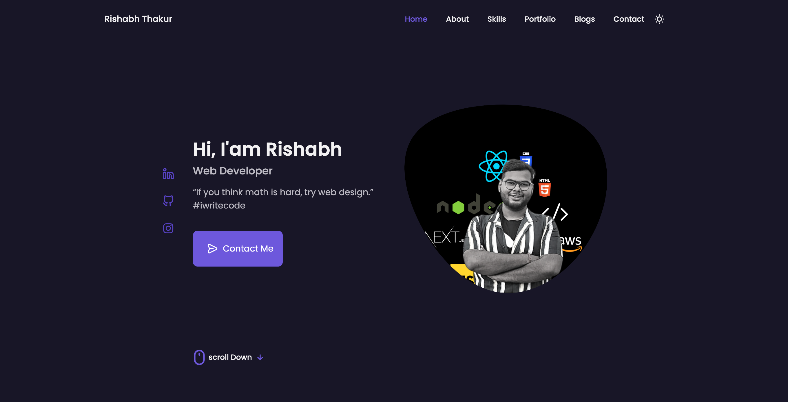

# Personal Portfolio Website

`Name:` Rishabh Thakur

This is my Personal Portfolio website designed fully with `HTML`, `CSS` and `Javascript`. The following website contains:

- Navbar
- Header
- About me Section
- Projects Section
- Contact Section
- Footer

# Learning Outcomes

- Structuring `text` and `image` content for the web using `HTML5`.
- Semantic `markup` new to the `HTML standard`.
- Styling a web page using `Cascading Style Sheets (CSS)`.
- Learnt the `inline and block model` for basic layout.
- Learnt the `Flexbox model` for advanced layout.
- Learn the `Grid model` for advanced layout.
- `Postioning` content with respect to `absolute, relative, fixed , sticky`.
- Making the UI beautiful using CSS concepts.
- Light and dark mode with toggle button
- Animation using Javascript
- Making website responsive using media queries

# Languages Used:

### HTML, CSS and Javascript

# Landing Page Screenshot

# Time Taken to complete

`8 hours`

# Deployed Landing Page Link

[Personal Portfolio Website](https://personal-portfolio-website-alpha.vercel.app/)

---
